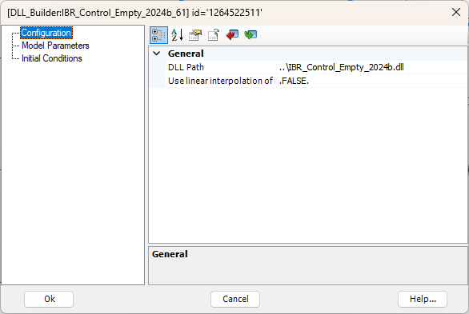
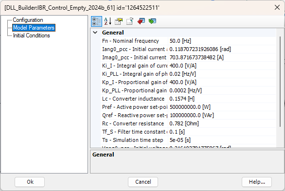
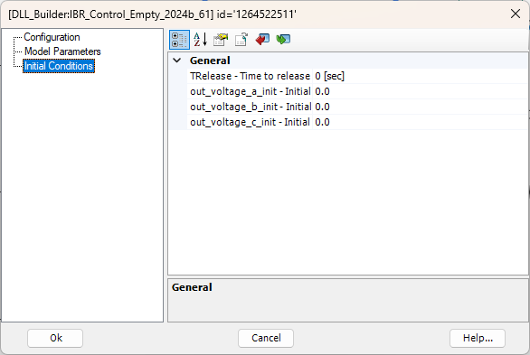

# PSCAD import tool for IEC 61400-27 (Ext-SimEnv) DLLs

This tool, written in Python, provides a simple Tkinter graphical
interface for turning a compiled **IEC 61400-27 / Ext-SimEnv** DLL
(matching the `ext_simenv_capi.h` C API) into a PSCAD DLL-based
component. The import tool's GUI is shown in Figure 1.

*Figure 1: Graphical User Interface of the PSCAD Import Tool*

This tool works only with **PSCAD version 5** and **Intel Fortran
compilers**. This may not work for old versions (2012 or less) of Intel
Fortran compilers.

The user may start by selecting an IEC 61400-27 DLL using the first
browse button to convert it into a PSCAD DLL-based component. The
integration process, orchestrated by `Application.generate_pscad_model()`,
consists of:

- Loading the DLL and checking its `Model_GetInfo()` metadata and API
  release (`DllIntrospectionMixin`); only DLLs with API release
  `0.8.1.5` are accepted.
- Creating and placing the component on the main canvas of a PSCAD
  project (`PscadProjectMixin`).
- Generating a Fortran interface file (`<dll_name>_FINTERFACE_PSCAD.f90`)
  that facilitates communication between the component and the DLL
  (`FortranCodegenMixin`).
- Adding the interface link to the project's resources.
- Copying both the Fortran interface file and the DLL to the project's
  folder.

The user has two options for integrating the component:

1. **Create New Project**: a new PSCAD project will be created inside
   the "Destination folder" specified using the second browse button.
   If that field is left empty or still shows its placeholder text, the
   DLL's own folder is used instead. After clicking "Generate PSCAD
   Model", the component will be created inside the new project.
2. **Use Available Project**: the import tool connects to a running
   PSCAD instance and lists all the open "Case" projects (libraries are
   excluded). After selecting one of the projects and clicking
   "Generate PSCAD Model", the component will be created inside the
   selected project.

Selecting either option attempts to connect to PSCAD
(`PscadConnectionMixin.init_pscad()`); if PSCAD is not installed or not
licensed, the selection automatically reverts to "Create New Project"
and an error is shown instead.

The import tool provides two more buttons on its GUI:

- **Refresh projects**: for refreshing the list of available projects
  in case new projects are loaded by the user.
- **Open project's location**: to navigate the user to the selected
  project's location, where the DLL and Fortran interface link are
  present.

As an example, Figure 2 (a) shows the representation of the IEC 61400-27 DLL component generated by the IEC DLL import tool in PSCAD software environment. 
By double-clicking on the component block, various settings can be edited as shown in Figure (b)-(d).

*Figure 2 a: Example of an IEC DLL component in PSCAD. Imported component*

*Figure 2 b: Example of an IEC DLL component in PSCAD. Configuration tab*

*Figure 2 c: Example of an IEC DLL component in PSCAD. Model Parameters tab*

*Figure 2 d: Example of an IEC DLL component in PSCAD. Initial Conditions tab*

More explanations for each tab can be found as follows:

- Configuration tab

In the first “Configuration” tab, the path to the DLL is specified. While the path is set automatically, the user can modify it by specifying a relative or absolute path.

It is also possible to enable or disable the input linear interpolation feature, which is useful only if the time step of the DLL model is different from that of the PSCAD simulation.

- Model Parameters tab

The parameters of the model are shown and can be edited from this tab. Data labels can be used for parameters.

- Initial Conditions tab

There are additional options available via this tab. For example, TRelease allows an IEEE/CIGRE DLL model to be held at initial conditions until a certain release time. The other parameters are used to assign initial values to the outputs.

After setting the parameters, the PSCAD simulation can be run.

## Notes

- Signal names longer than 31 characters are automatically shortened,
  since PSCAD limits signal names to 31 characters. Parameter names are
  not subject to this limit.
- The time-step of the PSCAD circuit can be set to a different value
  than the time-step of the DLL model. The user is free to decide
  whether or not to use the input interpolation in the Configuration
  tab.
- If the DLL is in 32-bit (respectively 64-bit), you must select a
  32-bit (respectively 64-bit) Intel Fortran compiler in the PSCAD
  options.
- Only DLLs with API release `0.8.1.5` are accepted; the import aborts
  with an error message otherwise.
- If PSCAD is closed while "Use Available Project" is selected, the
  connection is automatically re-established the next time it's needed.

## Project structure

| Module | Responsibility |
|---|---|
| `Application.py` | Composition root: maintains the shared state (signal/parameter lists, GUI references) and orchestrates the workflow when clicking "Generate PSCAD Model". |
| `gui_mixin.py` | Construction of the Tkinter widgets and their event handlers (radiobuttons, browse dialogs, placeholder texts, error/info messages). |
| `pscad_connection_mixin.py` | Connection to a running PSCAD-5.x instance, listing open projects, opening the project folder in Explorer. |
| `dll_introspection_mixin.py` | Loading the DLL via `ctypes`, reading `Model_GetInfo()`, checking the API version, and building the input/output/parameter lists. |
| `fortran_codegen_mixin.py` | Generation of the `<dll_name>_FINTERFACE_PSCAD.f90` wrapper (pure text generation, no GUI/DLL calls). |
| `pscad_project_mixin.py` | Creation/update of the PSCAD project and component via the `mhi.pscad` API (ports, mask, graphics, Fortran script, resource). |
| `IEC_DLLInterface.py` | `ctypes` mapping of the C structures from `ext_simenv_capi.h`. |

## References

- CIGRE TB958 JWG CIGRE B4.82/IEEE, «Guidelines for use of real-code in EMT models for HVDC, FACTs and inverter based generators in power systems analysis,» 2025.

- IEC 61400-27-1, *Wind energy generation systems -- Part 27-1: Electrical simulation models -- Generic models*.

