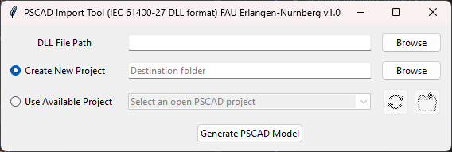
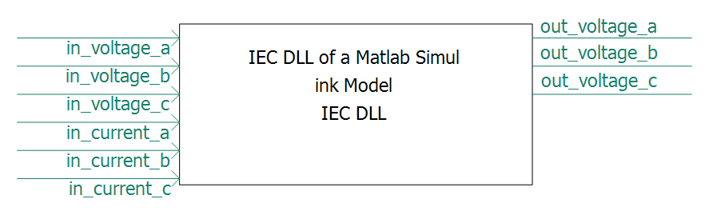

#######################################
PSCAD Import Tool for IEC 61400-27 DLLs
#######################################
Gregor Becker :sup:`1,*`, Dominik Frauenknecht :sup:`1,*`, Gert Mehlmann :sup:`1`, Johann Jaeger :sup:`1` and Matthias Luther :sup:`1`

| 1 Institue of Electrical Energy Systems, Friedrich-Alexander-Universität Erlangen-Nürnberg
| `*` These authors contributed equally and are thereby the corresponding authors.

******************************************
Background
******************************************

The modeling of HVDC, FACTS, wind power, solar power, and other
power-electronic equipment connected to the AC grid is an essential part of
most electrical system studies. As more and more power-electronic components
are integrated into power grids, the importance of a uniform reference format
for modeling control and protection systems is increasing.

One such format is the **IEC 61400-27 / Ext-SimEnv DLL interface**
(`ext_simenv_capi.h`). It allows control and protection models -- typically
identical code that also runs on a manufacturer's field hardware ("real
code") -- to be integrated as compiled DLLs into arbitrary power-system
simulation tools, including Electro-Magnetic-Transient (EMT) programs such
as PSCAD.

The **PSCAD Import Tool** performs exactly this task: It reads an
IEC 61400-27 DLL and automatically generates a Fortran wrapper file as well
as a corresponding PSCAD component/project with one input/output and
parameter per DLL signal.

.. note::
This tool is inspired by the `PSCAD-import-tool-for-IEEE-CIGRE-DLLs <https://github.com/rte-france/PSCAD-import-tool-for-IEEE-CIGRE-DLLs>`_
from the InterOPERA project (RTE / TU Delft), but targets the older,
related **IEC 61400-27** format (API release `0.8.1.5`) rather than the
newer CIGRE-TB958 format. Both formats are very similar in structure and
workflow.

******************************************
Architecture Overview
******************************************

The tool is implemented as a Tkinter GUI application and is divided into
several mixins, each covering a clearly defined area of responsibility:

+-------------------------------+-----------------------------------------------------------------------------------------------------------------------------------------------------------+
| Module                        | Responsibility                                                                                                                                            |  
+===============================+===========================================================================================================================================================+
| ``Application.py``            | Composition root: maintains the shared state (signal/parameter lists, GUI references) and orchestrates the workflow when clicking "Generate PSCAD Model". |
+-------------------------------+-----------------------------------------------------------------------------------------------------------------------------------------------------------+
| ``gui_mixin.py``              | Construction of the Tkinter widgets and their event handlers (radiobuttons, browse dialogs, placeholder texts, error/info messages).                      |
+-------------------------------+-----------------------------------------------------------------------------------------------------------------------------------------------------------+
| ``pscad_connection_mixin.py`` | Connection to a running PSCAD-5.x instance, listing open projects, opening the project folder in Explorer.                                                |
+-------------------------------+-----------------------------------------------------------------------------------------------------------------------------------------------------------+
| ``dll_introspection_mixin.py``| Loading the DLL via ``ctypes``, reading ``Model_GetInfo()``, checking the API version, and building the input/output/parameter lists.                     |
+-------------------------------+-----------------------------------------------------------------------------------------------------------------------------------------------------------+
| ``fortran_codegen_mixin.py``  | Generation of the ``<dll_name>_FINTERFACE_PSCAD.f90`` wrapper (pure text generation, no GUI/DLL calls).                                                   |
+-------------------------------+-----------------------------------------------------------------------------------------------------------------------------------------------------------+
| ``pscad_project_mixin.py``    | Creation/update of the PSCAD project and component via the ``mhi.pscad`` API (ports, mask, graphics, Fortran script, resource).                           |
+-------------------------------+-----------------------------------------------------------------------------------------------------------------------------------------------------------+
| ``IEC_DLLInterface.py``       | ``ctypes`` mapping of the C structures from ``ext_simenv_capi.h``.                                                                                        |
+-------------------------------+-----------------------------------------------------------------------------------------------------------------------------------------------------------+

******************************************
PSCAD Import Tool in Detail
******************************************

The tool is started via `IEC_DLL_PSCAD_Import_Tool.py` or the exectuable which can be build using pyinstaller by calling

..  code-block:: bash
    :caption: Calling Pyinstaller for executable generation.
    
    pyinstaller.exe --onefile --add-data "finterface_pscad.f90.tmpl;." .\IEC_DLL_PSCAD_Import_Tool.py

and opens a simple graphical window asking for your IEC DLL file path as well as the your choice building a new PSCAD model or 
adding the DLL Block to an existing one. 

    Graphical User Interface of the PSCAD import tool.

Prerequisites
-------------

* PSCAD version 5.x with a valid license.
* Matching Intel Fortran compiler (32-bit or 64-bit version, depending on the architecture of the DLL to be imported).
* An IEC 61400-27 / Ext-SimEnv-compatible DLL with API release `0.8.1.5` (checked in `DllIntrospectionMixin.get_and_check_dll_interface_version()`; 
  if the version differs, the tool terminates with an error message).

Workflow
--------

The user first selects the DLL to be imported via the first "Browse" button.
After clicking "Generate PSCAD Model", the tool performs the following steps
(orchestrated by `Application.generate_pscad_model()`):

1. Reset previously displayed error/info messages and internal lists (`clean_errors_and_info`, `clean_list_attributes`).
2. Validate the DLL path and load the `Model_GetInfo()` metadata (`DllIntrospectionMixin`).
3. Determine the target project and folder, depending on the selected option (see below).
4. Generate the Fortran wrapper file `<dll_name>_FINTERFACE_PSCAD.f90` and write it to the target folder (`FortranCodegenMixin`).
5. Copy the DLL to the target folder if it is not already present there.
6. Create or update the PSCAD project and component (`PscadProjectMixin`).

If an error occurs during this workflow, it is displayed as a red error message in the window instead of causing the application to crash.

The Two Project Options
-----------------------

The tool provides two mutually exclusive radiobuttons:

Option 1 – "Create New Project":
^^^^^^^^^^^^^^^^^^^^^^^^^^^^^^^^

A new PSCAD project is created in the specified destination folder.
If the destination folder field is empty or still contains the placeholder text, the DLL file's folder is used automatically (`PscadProjectMixin.get_destination_folder()`). 
The project name corresponds to the model name from the DLL, truncated to 50 characters.

Option 2 – "Use Available Project"
^^^^^^^^^^^^^^^^^^^^^^^^^^^^^^^^^^

The tool connects to an already running PSCAD instance (`PscadConnectionMixin.init_pscad()`) and lists all open "Case" projects (not libraries) in the combobox. 
After selecting a project, the component is placed in it. 

Two symbol buttons complement this option:

- **Refresh** (circular symbol) – updates the list of open projects.
- **Open project's location** (folder symbol) – opens the folder of the selected project in Explorer.

When either option is selected, an attempt is made to establish a PSCAD connection. 
If this fails (PSCAD is not installed or not licensed), the tool automatically switches back to Option 1 and displays an error (`GuiMixin.click_radio_button()`).

Generated PSCAD Component
-------------------------

For each imported DLL, a PSCAD component with the following
characteristics is generated (`PscadProjectMixin._add_ports` /
`_add_parameters_form` / `_add_graphics` / `_add_fortran_script`):

- One input port per DLL input signal (left) and one output port per DLL output signal (right), including the signal width.

    PSCAD component of the imported DLL.

- A mask ("Mask") with three tabs:

    - | `Configuration` 
      | Contains the (editable) path to the DLL (`DLL_Path`) as well as the `Use_Interpolation` option for linear interpolation of the inputs – relevant if the time step of the DLL model differs from the PSCAD simulation.

    ..  figure:: ../images/Figure2b.png
        :alt: Configuration menu of the PSCAD component of the imported DLL.
    
        Configuration menu of the PSCAD component of the imported DLL.

    - | `Model Parameters` 
      | All numerical model parameters of the DLL with name, description, unit, default, minimum, and maximum value. 
      | String parameters (`CHARACTER(*)`) are not supported here because the Ext-SimEnv C API only allows numerical values in its flat parameter array; the tool displays a warning in this case.

    ..  figure:: ../images/Figure2c.png
        :alt: Model parameters menu of the PSCAD component of the imported DLL.
    
        Model parameters menu of the PSCAD component of the imported DLL.

    - | `Initial Conditions` 
      | `TRelease` (time in seconds until which the model is held at its initial conditions) as well as one initial value per output signal (`<signal>_init`).

    ..  figure:: ../images/Figure2d.png
        :alt: Initial conditions menu of the PSCAD component of the imported DLL.
    
        Initial conditions menu of the PSCAD component of the imported DLL.

- A Fortran script that calls the generated `<dll_name>_FINTERFACE_PSCAD` subroutine.

- A project resource that references the generated `.f90` interface file.

The Generated Fortran Wrapper File
----------------------------------

`FortranCodegenMixin.create_fortran_code()` generates a `<dll_name>_FINTERFACE_PSCAD.f90` file with two parts:

- A `MODULE <dll_name>_MOD` containing the types corresponding to `ext_simenv_capi.h`, the DLL function `INTERFACE`, helper routines for loading the DLL function pointers, and smaller helper functions (including persisting a `c_ptr` via PSCAD's `STORI`).
- A `SUBROUTINE <dll_name>_FINTERFACE_PSCAD(...)` that is called by PSCAD at every simulation time step. 
  It creates the DLL-specific model instance once (`Model_Instance`), retains its handle via PSCAD's `STORI` between time steps, maps the flat `ExtU`/`ExtY`/`P` arrays of the instance using `c_f_pointer`, writes inputs/outputs and parameters, calls `Model_CheckParameters` / `Model_Initialize` / `Model_Outputs` / `Model_Update`, and temporarily stores the outputs in `STORF` so that PSCAD has them available at any time, even outside the model's own sampling steps.

The static Fortran boilerplate is located in `finterface_pscad.f90.tmpl` next to the module and is combined with the dynamically generated fragments using `string.Template`.

*****
Notes
*****

- The tool works exclusively with **PSCAD version 5.x** and the associated **Intel Fortran compilers**; older compiler versions (2012 or earlier) are not supported.
- If the DLL is available as a 32-bit (or 64-bit) binary, the matching 32-bit (or 64-bit) Intel Fortran compiler must be selected in the PSCAD options.
- Signal names are automatically shortened if necessary because PSCAD signal names are limited to 31 characters (`DllIntrospectionMixin.shorten_if_limit_exceeded`). Parameter names are not subject to this limitation.
- Only DLLs with API release `0.8.1.5` are accepted; if the version differs, the import terminates with an error message.
- When "Use Available Project" is selected, the connection to PSCAD is automatically re-established when necessary (e.g. if PSCAD was closed
  in the meantime).

**********
References
**********

- IEC 61400-27-1, "Wind energy generation systems – Part 27-1: Electrical simulation models -- Generic models".
- MARTIN César, DEHGHAN MARVASTI Farzad, "PSCAD import tool for IEEE/CIGRE DLLs", InterOPERA project (Grant Agreement 101095874), 01.06.2023, last updated 21.01.2025. DOI: https://doi.org/10.5281/zenodo.15593233
- CIGRE TB958 JWG CIGRE B4.82/IEEE, "Guidelines for use of real-code in EMT models for HVDC, FACTs and inverter based generators in power systems analysis", 2025.

.. toctree::
   :maxdepth: 3
   :hidden:
   :caption: Usage

   API_documentation

